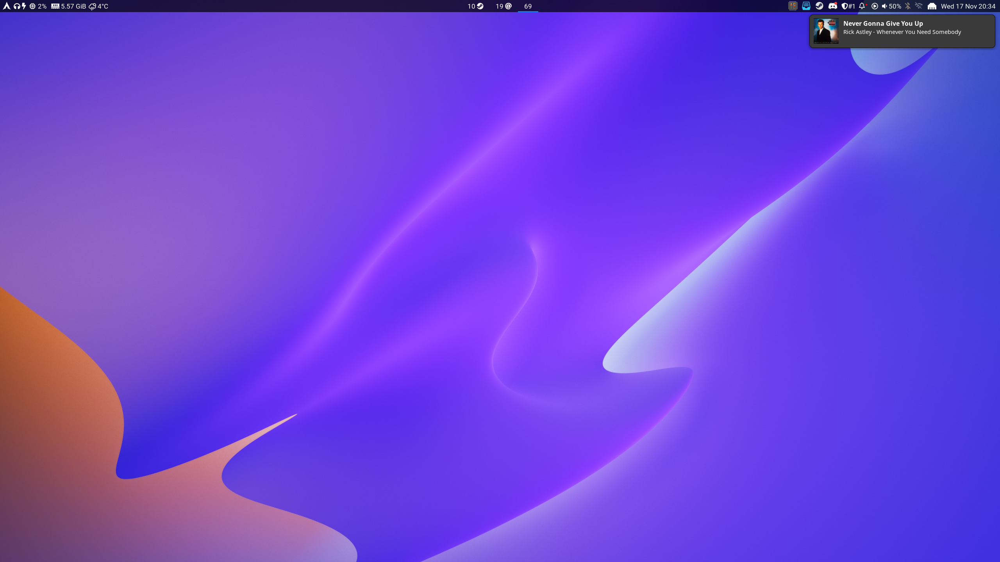

[](https://github.com/ErikReider/SwayNotificationCenter/actions/workflows/building.yml)

# SwayNotificationCenter

A simple notification daemon with a GTK gui for notifications and the control center

## Features

- Keyboard shortcuts
- Notification body markup with image support
- A panel to view previous notifications
- Show album art for notifications like Spotify
- Do not disturb
- Click notification to execute default action
- Show alternative notification actions
- Customization through a CSS file
- Trackpad/mouse gesture to close notification
- The same features as any other basic notification daemon
- Basic configuration through a JSON config file
- Hot-reload config through `swaync-client`

## Planned Features

- Slick animations 😎
- Other build scripts than a PKGBUILD (debian and/or RHEL systems)

## Install

Arch:
The package is available on the AUR:

- [swaync](https://aur.archlinux.org/packages/swaync/)
- [swaync-git](https://aur.archlinux.org/packages/swaync-git/)

Fedora:
An **unofficial** build is available in copr:

``` zsh
dnf copr enable lexa/SwayNotificationCenter
dnf install SwayNotificationCenter
```

Gentoo:
An **unofficial** ebuild is available in GURU:

``` zsh
eselect repository enable guru
emaint sync -r guru
emerge --ask swaync
```

Other:

```zsh
meson build
ninja -C build
meson install -C build
```

## Sway Usage

```ini
# Notification Daemon
exec swaync

# Toggle control center
bindsym $mod+Shift+n exec swaync-client -t -sw
```

## Run

To start the daemon (remember to kill any other notification daemon before running)

```zsh
./build/src/swaync
```

To toggle the panel

```zsh
./build/src/swaync-client -t
```

To reload the config

```zsh
./build/src/swaync-client -R
```

To reload css after changes

```zsh
./build/src/swaync-client -rs
```

## Control Center Shortcuts

- Up/Down: Navigate notifications
- Home: Navigate to the latest notification
- End: Navigate to the oldest notification
- Escape/Caps_Lock: Close notification panel
- Return: Execute default action or close notification if none
- Delete/BackSpace: Close notification
- Shift+C: Close all notifications
- Shift+D: Toggle Do Not Disturb
- Buttons 1-9: Execute alternative actions

## Configuring

The main config file is located in `/etc/xdg/swaync/config.json`. Copy it over
to your `.config/swaync/` folder to customize without needing root access.

To reload the config, you'll need to run `swaync-client --reload-config`

- `positionX`: `left`, `right` or `center`
- `positionY`: `top` or `bottom`
- `timeout`: uint (Any positive number). The notification timeout for notifications with normal priority
- `timeout-low`: uint (any positive number without decimals). The notification timeout for notifications with low priority
- `timeout-critical`: uint (any positive number without decimals, 0 to disable). The notification timeout for notifications with critical priority
- `keyboard-shortcuts`: `true` or `false`. If control center should use keyboard shortcuts
- `image-visibility`: `always`, `when-available` or `never`. Notification image visiblilty
- `transition-time`: uint (Any positive number, 0 to disable). The notification animation duration
- `notification-window-width`: uint (Any positive number). Width of the notification in pixels
- `hide-on-clear`: bool. Hides the control center after pressing "Clear All"
- `hide-on-action`: bool. Hides the control center when clicking on notification action
- `control-center-margin-top`: uint (Any positive number, 0 to disable). The margin (in pixels) at the top of the notification center
- `control-center-margin-bottom`: uint (Any positive number, 0 to disable). The margin (in pixels) at the bottom of the notification center
- `control-center-margin-right`: uint (Any positive number, 0 to disable). The margin (in pixels) at the right of the notification center
- `control-center-margin-left`: uint (Any positive number, 0 to disable). The margin (in pixels) at the left of the notification center
- `script-fail-notify`: bool. Sends a notification with error message if a script fails

The main CSS style file is located in `/etc/xdg/swaync/style.css`. Copy it over to your `.config/swaync/` folder to customize without needing root access.

## Scripting

Scripting rules and logic:

- <b>Only one</b> script can be fired per notification
- Each script requires `exec` and at least one of the other properties
- All listed properties must match the notification for the script to be ran
- If any of the propeties doesn't match, the script will be skipped
- If a notification doesn't include one of the properties, that property will
be skipped

Notification information can be printed into a terminal by running
`G_MESSAGES_DEBUG=all swaync` (when a notification appears).

Config properties:

```json
{
  "scripts": {
    "example-script": {
      "exec": "Your shell command or script here...",
      "app-name": "Notification app-name Regex",
      "summary": "Notification summary Regex",
      "body": "Notification body Regex",
      "urgency": "Low or Normal or Critical",
      "category": "Notification category Regex"
    }
  }
  other non scripting properties...
}
```

`config.json` example:

```json
{
  "scripts": {
    // This script will only run when Spotify sends a notification containing
    // that exact summary and body
    "example-script": {
      "exec": "~/.config/swaync/myRickRollScript.sh",
      "app-name": "Spotify"
      "summary": "Never Gonna Give You Up",
      "body": "Rick Astley - Whenever You Need Somebody"
    }
  }
  other non scripting properties...
}
```

### Disable scripting

To completely disable scripting, the project needs to be built like so:

```zsh
meson build -Dscripting=false
ninja -C build
meson install -C build
```

## Waybar Example

This example requires `NotoSansMono Nerd Font` to get the icons looking right

Waybar config

```json
  "custom/notification": {
    "tooltip": false,
    "format": "{icon}",
    "format-icons": {
      "notification": "<span foreground='red'><sup></sup></span>",
      "none": "",
      "dnd-notification": "<span foreground='red'><sup></sup></span>",
      "dnd-none": ""
    },
    "return-type": "json",
    "exec-if": "which swaync-client",
    "exec": "swaync-client -swb",
    "on-click": "swaync-client -t -sw",
    "on-click-right": "swaync-client -d -sw",
    "escape": true
  },
```

Waybar css file

```css
#custom-notification {
  font-family: "NotoSansMono Nerd Font";
}
```

## Screenshots




I wonder how this would look with some blur 🤔
